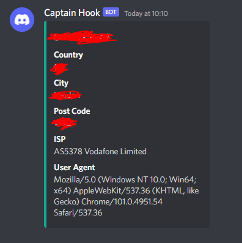

# Patrick -- The Bot
Seemingly a blog post about how I made a discord bot, but it's actually an IP logger.

# How it works?
-  The PHP file takes the IP of the client and gets GEO information of that IP with the help of an API.  
I then also take the user agent of the client, just for good measure.  
-  Make a discord embed from an assoc. array and json encode it.
- Set up a discord webhook on a server.
- Create an app on heroku.
- Have a curl object send the json object to a discord webhook, under the `$url` variable. --> Set with : `heroku config:set url=webhook_url`